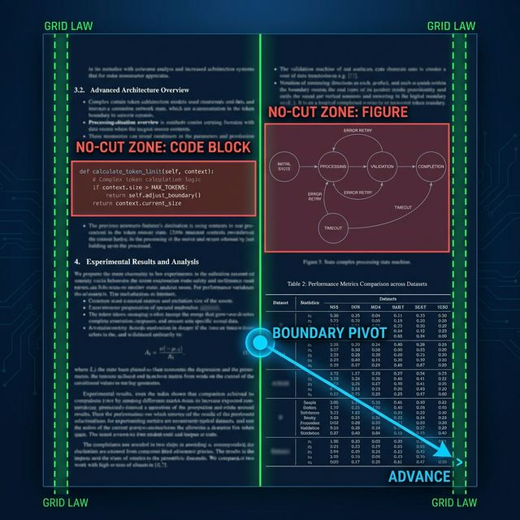
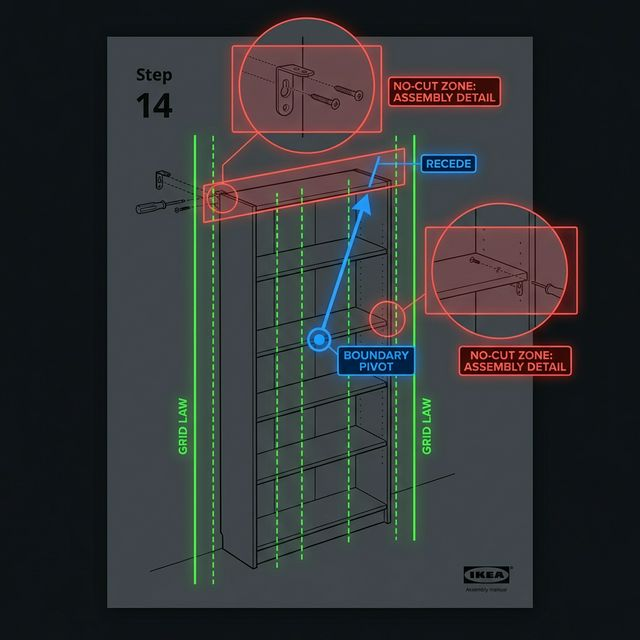

# Whitepaper: The Geometric Integrity Protocol (GIP)
**Technical Specification: A Unified Standard for Deterministic Data Ingestion in RAG**

## 1. Abstract
The effectiveness of Retrieval-Augmented Generation (RAG) is fundamentally restricted by the "Structural Fragmentation" of source documents. Standard chunking methods slice text into chunks based on character or token counts, often bisecting tables and breaking semantic relationships. This paper introduces the **Geometric Integrity Protocol (GIP)**—a cross-platform specification that treats documents as 2D coordinate maps rather than linear strings. By using spatial geometry and "Grid Law" heuristics, GIP provides a unified standard for .NET and Python environments to ensure that structural context is preserved throughout the ingestion pipeline.

## 2. The Problem: The "Slicing" Effect
Most AI systems read documents like a long ribbon of text. When the system reaches its "limit" (e.g., 500 words), it cuts the ribbon.

### The Failure
If that cut happens in the middle of a table, the first chunk gets the headers (e.g., "Price," "Date") and the second chunk gets the numbers (e.g., "$100," "Jan 1st"). When the AI searches for "$100," it finds the number but has no idea it refers to a "Price" because that label was left behind in the previous chunk. This is the primary cause of "hallucinations" in business AI applications.

## 3. Methodology: The Grid Law
To fix this without using expensive AI models, we use the **Grid Law**. Every digital document is built on a coordinate system (X and Y).

### 3.1 Detecting the Grid
Imagine drawing a vertical line through a document. If you see many words starting at the exact same horizontal position (X) over several lines, you have found a column.
- **X-Coordinate**: The horizontal position (left to right).
- **Y-Coordinate**: The vertical position (top to bottom).

### 3.2 The Simple Math of Alignment
We use a basic math concept called **Standard Deviation (σ)** to see how "aligned" text is.
- If σ is near zero, the text is perfectly lined up (like a table column).
- If σ is high, the text is scattered (like a normal paragraph).

**The Rule**: If we detect a low σ across multiple lines, we mark that area as a **"No-Cut Zone."**

## 4. The Appendix: Advanced Clustering & Logic
To handle complex documents like newsletters or multi-column reports, the protocol uses three math-based layers.

### Layer A: The Density Test
We count how many "gaps" exist in a line.
- **Paragraph**: 1 word → small space → 1 word (low gaps).
- **Table**: Word → Huge Gap → Word → Huge Gap (high gaps).
If a line has multiple large gaps that line up vertically with the gaps in the lines above and below it, it is mathematically a table.

### Layer B: The Proximity Rule
Information that is physically close together on a page is usually related. We use the Pythagorean Theorem to calculate the distance (d) between objects:

$$
d = \sqrt{(x_2 - x_1)^2 + (y_2 - y_1)^2}
$$

If the distance between a label and a data point is very small, they are "locked" together. The system will not allow a chunk boundary to come between them.

### Layer C: The Elastic Boundary (The Fix)
When the system reaches its word limit (the "Boundary"), it checks if it is currently inside a No-Cut Zone.
1. **Check the Midpoint**: It looks at where it is in the table.
2. **The Decision**:
   - If it is at the beginning of the table, it "shrinks" the chunk so the table starts fresh in the next one.
   - If it is past the middle, it "stretches" the chunk to include the rest of the table.

**Result**: The table always stays in one piece.

### 4.1 Visualizing the Protocol
The following figures demonstrate how Aegis interprets complex layouts, from vertical columns in academic papers to non-linear illustrations in assembly manuals.

#### Scenario A: The Multi-Column Technical Paper

*Figure 3: Aegis Protocol applying Grid Laws and No-Cut Zones to a complex technical paper.*

**Key Observations:**
*   **Grid Law Alignment (Green)**: Vertical lines identify the structural backbone of columns.
*   **No-Cut Zones (Red)**: Code blocks and diagrams are "locked" to prevent context fragmentation.
*   **Boundary Pivot (Blue)**: The **Advance** strategy is applied to stretch the chunk to keep Figure 2 whole.

#### Scenario B: The Illustration-Heavy Instruction Manual

*Figure 4: Aegis Protocol detecting invariants in a graphic-heavy IKEA manual.*

**Key Observations:**
*   **Geometric Invariants (Green)**: Despite minimal text, Aegis detects the vertical alignment of the shelves and furniture frame as "Invariants."
*   **Visual Logic Anchors (Red)**: Detail callouts and assembly steps are identified as non-splittable units.
*   **Reverse Backpressure (Blue)**: A boundary hit in the middle of a shelf triggers a **Recede** strategy, shortening the chunk to ensure the next chunk starts clean at the top of the furniture unit.

## 5. Implementation & Efficiency
Because this uses basic geometry (X,Y coordinates) rather than "reading" the content with an AI, it is:
- **Instant**: It runs as fast as your computer can read a file.
- **Deterministic**: It will give the same result every single time.
- **Cost-Free**: It requires no external paid APIs or cloud processing.

## 6. Comparison with Industry Standards: The "Last Mile" Gap
The following table evaluates current state-of-the-art (SOTA) tools. While these tools are excellent at Extraction (Layer 1), they lack the **Geometric Backpressure** (Layer 2) required for production RAG.

| Capability | Adobe Extract / AWS Textract | IBM Docling / Unstructured.io | Aegis Protocol |
| :--- | :--- | :--- | :--- |
| **Primary Method** | ML / Vision Models | VLM / PDF-to-Markdown | Binary Grid Laws |
| **Output Type** | Static JSON / CSV | Static Markdown | Dynamic Integrity Stream |
| **Chunk Awareness** | No (External process) | No (External process) | Yes (Internal Pipe) |
| **Cost / Speed** | High (Per page API cost) | Medium (GPU Intensive) | Zero (Native I/O) |
| **Integrity Logic** | None (Hands off data) | None (Hands off data) | Backpressure Negotiation |

## 7. Strategic Architecture

### 7.1 Auditability vs. Probability
In regulated industries (Finance, Healthcare), the "Black Box" nature of LLM-based parsing is a liability. Aegis provides a **Deterministic Source of Truth**. Because the chunking logic is based on 2D physics (Standard Deviation of X-Coordinates), the process is auditable. You can prove *why* a document was split in a specific way, which is impossible with probabilistic text splitters.

### 7.2 The Sovereign Pipeline
Aegis introduces **Sovereign Hardening** for enterprise-scale ingestion.
*   **O(1) Interval Mapping**: Instead of linear structural searches, Aegis pre-computes a structural index map during ingestion. This allows the Integrity Pipe to verify boundaries with sub-millisecond, constant-time overhead.
*   **Zero-Copy Networking**: It utilizes `System.IO.Pipelines` and `Span<T>` in C# and optimized memory-views in Python to process documents without allocating massive strings on the Heap.
*   **Serverless Ready**: It is designed to run in constrained environments (Azure Functions, AWS Lambda) where memory is expensive.

### 7.3 The Universal Standard
By providing a mathematically identical implementation in both **C#** (`Aegis.Integrity`) and **Python** (`aegis_integrity`), Aegis bridges the gap between Backend Engineering and Data Science. It allows an organization to have a single, unified definition of "Document Integrity" across all departments.

## 8. Conclusion
The Geometric Integrity Protocol solves the "fragmentation" problem by respecting the physical layout of information. By aligning the AI's "view" with the visual grid of the document, we ensure that context is preserved, retrieval is accurate, and the AI's answers remain factual.
